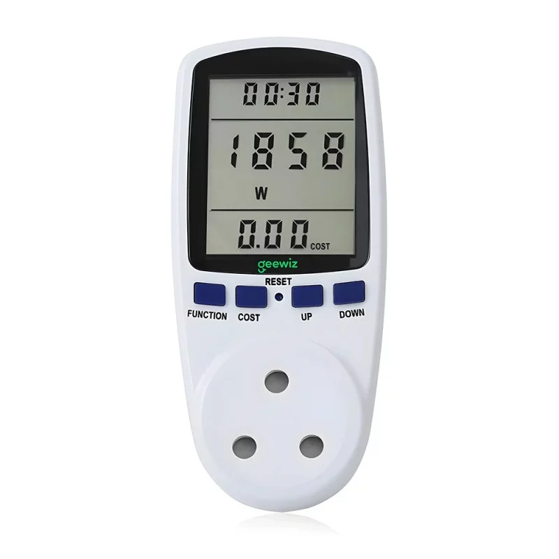
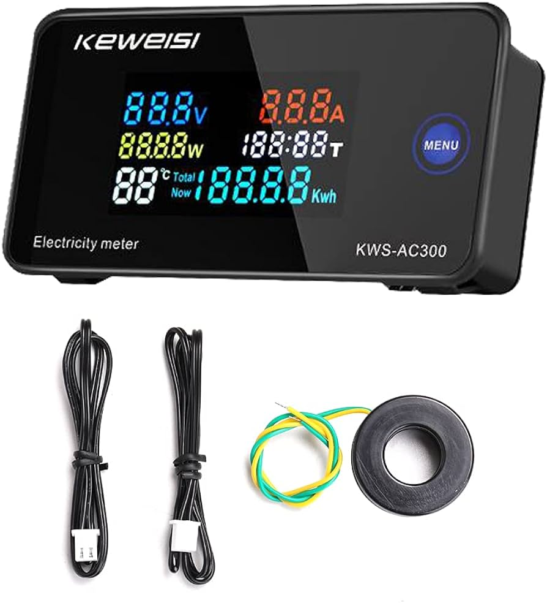
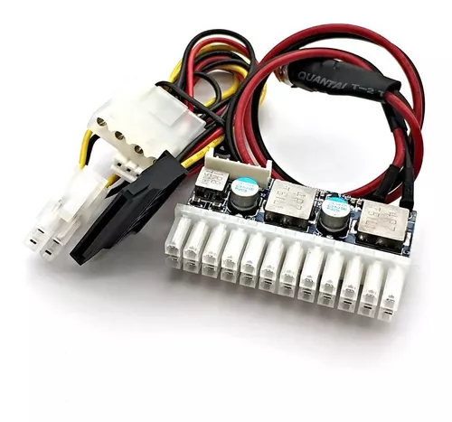
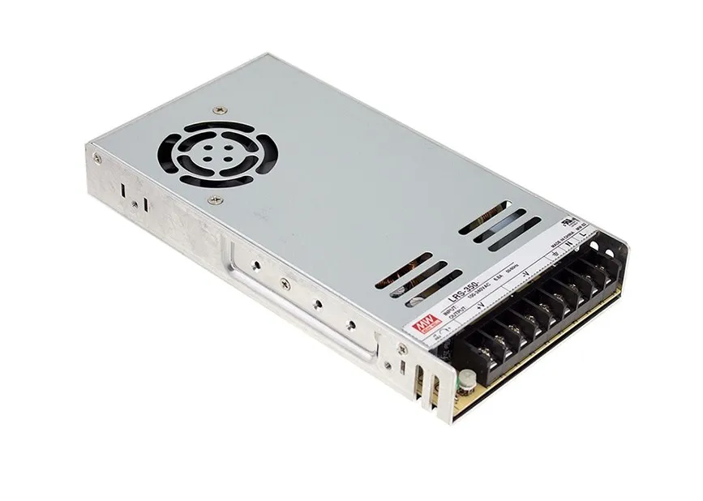
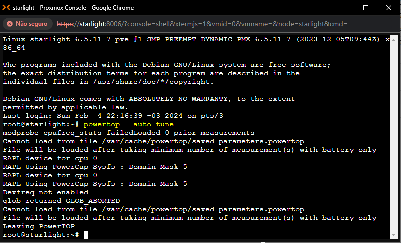
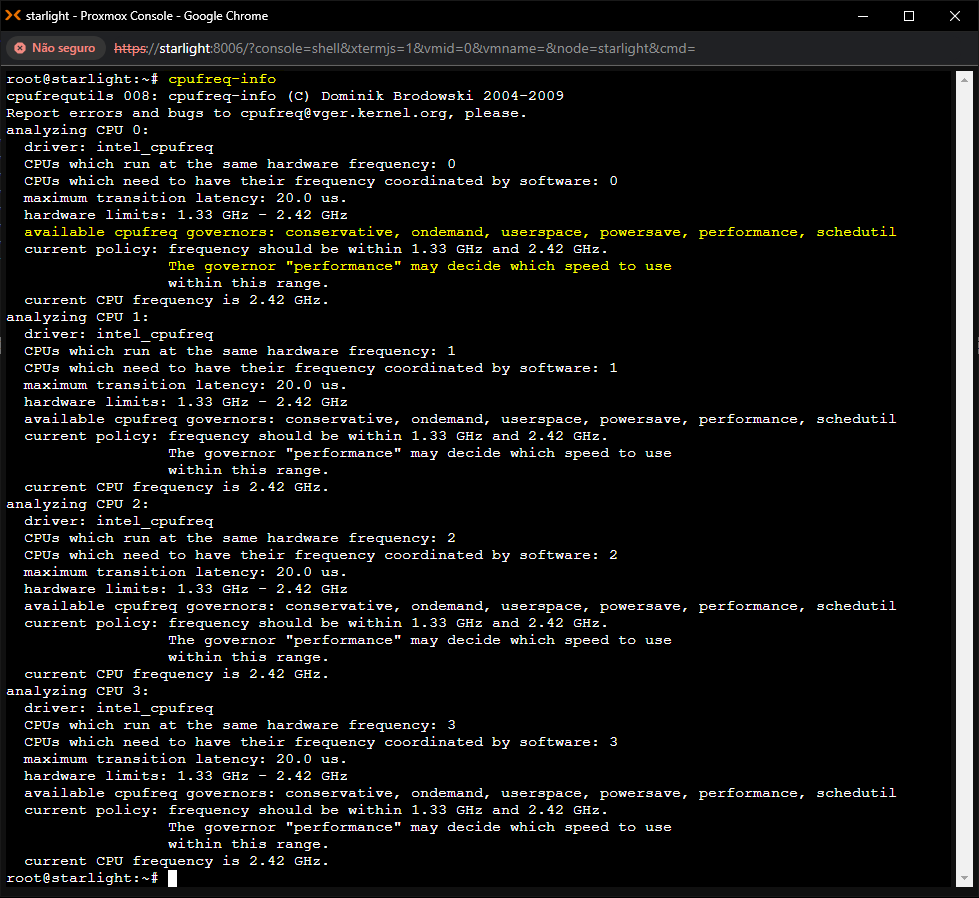
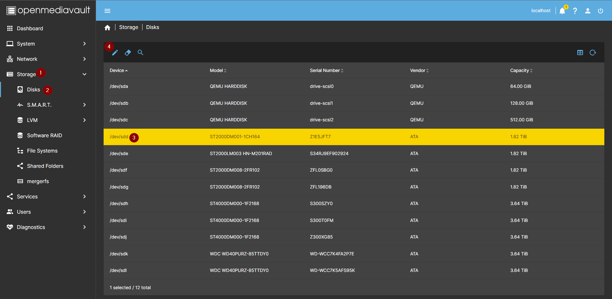
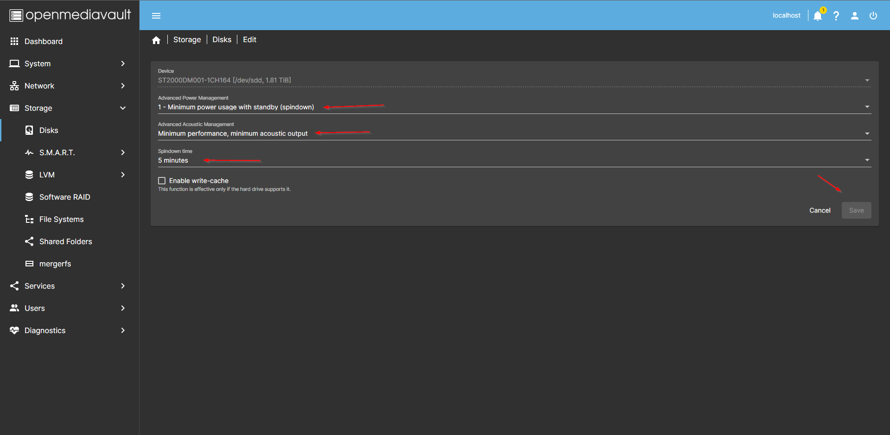

# EconomiaEnergia
Este Repositório tem dicas de redução de Consumo de Energia em NAS e Home Server

# Como você pode apoiar o meu trabalho

[Seja membro no Youtube](https://www.youtube.com/@LeandroPinheiroTI/membership)

[Mande uma Gorjeta no PIX](https://livepix.gg/leandropinheiroti)

[Compre no Aliexpress](https://s.click.aliexpress.com/e/_DC6mCFt)

[Compre na Amazon](https://www.amazon.com.br/?&_encoding=UTF8&tag=canalblackit-20&linkCode=ur2&linkId=e9810db94398d707188c4d341e4a264a&camp=1789&creative=9325)

# Meus vídeos sobre o tema

[](https://youtu.be/DvxArzs84t0)

# Você vai precisar de um instrumento pra medir o consumo

>[!TIP]
>
> Se você não tem como medir o consumo, não tem como saber quanto está usando agora, nem qual a economia que os procedimentos abaixo vão proporcionar.
>
> 
> 

Abaixo alguns links para você comprar o seu medidor, são links de afiliado que ajudam o canal com comissão e você não paga nada a mais por isso:

* **ALIEXPRESS:** ***SINOTIMER*** é a marca e modelo do meu, escolham um que tenha luz de fundo [LINK](https://s.click.aliexpress.com/e/_DFwfFAv)
* **AMAZON BRASIL:** Esse é similar ao do ***Aliexpress*** [LINK](https://www.amazon.com.br/watt%25C3%25ADmetro-dispositivo-monitoramento-eletricidade-Measuring/dp/B095HW768M/ref=sr_1_8?__mk_pt_BR=%25C3%2585M%25C3%2585%25C5%25BD%25C3%2595%25C3%2591&amp;crid=6YCSHY42PCR0&amp;keywords=medidor%252Bde%252Benergia&amp;qid=1707334874&amp;sprefix=medidor%252Bde%252Benergia%252Caps%252C217&amp;sr=8-8&amp;th=1&_encoding=UTF8&tag=canalblackit-20&linkCode=ur2&linkId=eb278323b43b6f25d8e7cc25b4634865&camp=1789&creative=9325)
* **AMAZON BRASIL:** Esse é bem interessante pois é um módul de bancada, e tem uma leitura mais fácil do LCD, é mais barato, mas precisa colocar Plugues de Tomada [LINK](https://www.amazon.com.br/AC50-300V-Volt%25C3%25ADmetro-Amper%25C3%25ADmetro-Temperatura-Dispositivo/dp/B098JQSVMZ/ref=sr_1_15?__mk_pt_BR=%25C3%2585M%25C3%2585%25C5%25BD%25C3%2595%25C3%2591&amp;crid=6YCSHY42PCR0&amp;keywords=medidor%252Bde%252Benergia&amp;qid=1707335702&amp;sprefix=medidor%252Bde%252Benergia%252Caps%252C217&amp;sr=8-15&amp;th=1&_encoding=UTF8&tag=canalblackit-20&linkCode=ur2&linkId=30fb01cd2e152bbc1732f11f4ec61a28&camp=1789&creative=9325)
  
# Menos é mais
Tudo que você pluga no servidor consome energia

O Servidor normalmente é headless (sem vídeo), se a sua placa mãe suporta boot sem placa de vídeo é melhor remover, se a placa mãe/CPU tem iGPU, prefira usar a iGPU, as intel tem aceleração de codificação/decodificação desde a 5ª Geração dos Core.

* Jellyfin [HWA Tutorial On Intel GPU](https://jellyfin.org/docs/general/administration/hardware-acceleration/intel/)
* Wikipedia [Broadwell Micro Architecture](https://pt.wikipedia.org/wiki/Broadwell_(microarquitetura))

Sempre que possivel remova:
* Módulos de memória
* Teclado e mouse
* Monitor
* Placa de Vídeo

# Escolha Componentes Corretamente

Prefira usar:
* Modulos de memória LDDR (consomem menos)
* SSD SATA ao invés de NVME (consome menos)
* HDD 5400 vs 7200 (consome menos)
* HDD Notebook vs Desktop (consome menos)
* Placa Mãe ITX geralmente consome menos, por ter menos componentes

>[!TIP]
>Utilize fonte PICO PSU em conjunto com uma Fonte Meanwell de 12v, Fonte ATX não é eficiente com baixa utilização, aqui tenho uma placa J1900 que consome 28w com uma fonte ATX e 8w com uma fonte PICO PSU, só mudando de fonte.
>
>
>
>

# Linux Tem Recursos extras de Conservação de Energia

Alguns recursos encontrados em distribuições Linux, os exemplos aqui são do PROXMOX que é baseado em Debian, então provavelmente vai funcionar qualquer distribuição baseada em Debian, exemplos: OMV, Ubuntu, Proxmox, etc.

Para outras distribuições deve funcionar também, mas você tem que pesquisar qual o nome dos pacotes e como instalar os mesmos.

# POWERTOP

É uma ferramente para monitorar o consumo de energia, também serve para calibrar baterias de notebooks, e habilitar funcionalidades de conservação de energia em qualquer computador.

>[!WARNING]
>  *** ATENÇÃO ALGUM HARDWARE PODE SER INCOMPATIVEL COM AS ALTERAÇÕES DO POWERTOP, ANTES DE APLICAR DEFINITIVAMENTE TESTE, SE DER ALGUM PROBLEMA DE TRAVAMENTO, OU DISCOS QUE DESCONECTAM, REINICIE E NÃO USE ***

>[!TIP]
>  *** AQUI EU TENHO DUAS CONTROLADORAS DE DISCO, UMA SATA E OUTRA SAS, AMBAS EU TIVE QUE ATUALIZAR O FIRMWARE PARA PARAR DE DAR PROBLEMA COM O POWERTOP, O FIRMWARE QUE VEIO DO FABRICANTE CHINES ERA MUITO ANTIGO E NÃO FUNCIONAVA DIREITO ***

>[!NOTE]
>
> É normal o ***SERVER*** reiniciar ao executar o o **POWERTOP** pela primeira vez.

## Instalar o Powertop

```
apt install powertop
```

Se você não está logado como root

```
sudo apt install powertop
```

## Testar o Powertop

```
powertop --auto-tune
```

Se você não está logado como root

```
sudo powertop --auto-tune
```



## Fazendo o Powertop aplicar no boot

Caso você não tenha nenhum problema utilizando o **powertop** no modo interativo, que tal tornar automatico o auto tune?

Edite o arquivo Cron utilizando o utilitário crontab como **root**.

```
crontab -e
```

Se você não está logado como root

```
sudo crontab -e
```

Adicione a seguinte linha no arquivo:

```
@reboot /bin/sleep 60 && /sbin/powertop --auto-tune -q > /dev/null
```

Feche e salve o editor.

# Controle a Frequencia da sua CPU

O Linux tem uma ferramenta de controle do clock da CPU, o **cpufreqd**!

A ideia é alterar o [Governor](https://www.kernel.org/doc/Documentation/cpu-freq/governors.txt), que controla como o processador vai utilizar o clock da CPU.

>[!TIP]
>CPU Frequency Governors disponíveis:
>
>* Performance
>* Powersave
>* Userspace
>* Ondemand
>* Conservative
>* Schedutil

Em Processadores Xeon ou Core, ate´faz sentido configurar o Governor como **powersave**, ele vai limitar o Clock da CPU ao valor ***BASE***.

Em Processadores como o Celeron J1900/J1800, N5105/N5095, N6005, N100, que já consomem muito pouco, eu recomendo configurar o Governor como **performance**, ele vai tentar utilizar o Clock da CPU no valor ***TURBO***.

Se você quer deixar o Clock variando com tendencia a economia utilize o Governor **conservative**.

O Normal é Governor **ondemand**, ele vai entregar o Clock conforme requisitado pelos processos, com tentendia a performance.

## Instalar o cpufreq

```
apt install cpufreqd cpufrequtils
```

Se você não está logado como root

```
sudo apt install cpufreqd cpufrequtils
```

## Verificar qual o Governor está em uso?

Qual governor está em uso, e quais posso utilizar no meu sistema?

```
cpufreq-info
```



## Alterar o Governor de forma interativa

Alterar para ***Powersave***:

```
cpufreq-set -g powersave
```
Se você não está logado como root
```
sudo cpufreq-set -g powersave
```

Alterar para ***Performance***:

```
cpufreq-set -g performance
```
Se você não está logado como root
```
sudo cpufreq-set -g performance
```

## Fazendo o cpufreq-set aplicar no boot

Edite o arquivo Cron utilizando o utilitário crontab como **root**.

```
crontab -e
```

Se você não está logado como root

```
sudo crontab -e
```

Adicione a seguinte linha no arquivo:

```
@reboot /bin/sleep 60 && /bin/cpufreq-set -g powersave
```

Feche e salve o editor.

# HARD DISK DRIVE (HDD) é um vilão

Os HDDs são verdadeiros vilões no consumo de energia de um NAS ou servidor.

Sempre que possível configure os seus HDDs para fazer **spindown (parar de rodas)**, utilizar baixo consumo de energia, e baixa emissão de ruidos, isso diminui a performance, mas também diminui o consumo, para redes **Gigabit** nem dá pra notar.

RAID ou ZFS precisam fazer a leitura/gravação em todos os Discos do Array ao mesmo tempo, multiplicando o consumo de energia.

HDD de Notebook em geral consome menos que os de Desktop.

Utilizar MERGERFS para exibir vários discos como um **Discão***, e o SnapRAID para fazer a **Paridade** dos discos, e utilizar um SSD como **Cache** para evitar ***Ligar*** os HDDs sem necessecidade, ajudam muito a reduzir o consumo de energia.

## COMO CONFIGURAR OS DISCOS PARA ECONOMIA NO OPEN MEDIA VAULT

Para cada disco no OMV, configure na aba **STORAGE** de acordo com os prints abaixo:





>[!WARNING]
>
>**Não habilitem o WRITE CACHE**
>
>Essa funcionalidade aumenta a performance de gravação, pouca coisa.
>
>Entretanto se teu servidor trava, ou falta energia sempre, e não tem no-break, essa funcionalidade pode levar a perca de dados.
>
>Ela funciona enviando uma confirmação de gravação na mídia do Disco, mesmo os dados ainda estando em **CACHE**, como o cache é RAM, ao reiniciar, ou faltar energia, o que estava somente no CACHE e ainda não foi gravado no Disco será perdido.

>[!NOTE]
>
>* Esse GIT é um trabalho em progresso, a medida que for testanto as coisas vou adicionando aqui.
>* Assine esse REPO pra ficar sabendo das atualizações.
>* Se Inscreva no meu canal do Youtube.
>* Se puder contribua financeiramente com o meu trabalho.
